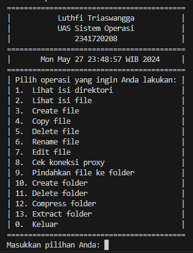

# DATA DIRI

|  |  |
|--|--|
| NIM | **2341720208** |
| Nama Lengkap | **Luthfi Triaswangga** |
| Kelas | TI - 1B |
| No Absen | 17 |
| Dosen Pengampu | [Mohammad Faried Rahmat, S.ST., M.Tr.T](https://github.com/mrhmt80) |    

# SISTEM OPERASI
### Fitur VArchiver
|  |  |  |
|--|--|--|
|**No**| **Fitur** | **Detail** |
| 1 | Lihat Isi Direktori | Melihat daftar isi sebuah direktori dengan perintah ***ls -l*** |
| 2 | Lihat Isi File | Melihat isi dari sebuah file dengan perintah ***cat*** |
| 3 | Create file | Membuat file dengan perintah  ***nano*** |
| 4 | Copy File | Mengduplikat file dengan perintah ***cp*** |
| 5 | Delete File | Menghapus file dari sebuah direktori dengan perintah ***rm -i*** |
| 6 | Rename File | Mengganti nama file dari sebuah direktori dengan perintah ***mv*** |
| 7 | Edit File | Mengubah isi file dengan perintah ***nano*** |
| 8 | Cek Koneksi Proxy | Mengecek proxy dari sebuah website dengan perintah ***curl*** |
| 9 | Move File | Memindahkan file dengan perintah ***mv*** |
| 10 | Create Folder | Membuat folder dengan perintah ***mkdir*** |
| 11 | Delete Folder | Menghapus sebuah folder dengan perintah ***rm -r***|
| 12 | Compress Folder | Mengompres folder dengan perintah ***tar -czf*** |
| 13 | Extract Folder | Mengekstrak folder dengan perintah ***tar -xf*** |
| 0 | Keluar | Keluar dari direktori dengan perintah ***exit 0*** |
# SCREENSHOT PROGRAM
 
| VArchiver - Program Shell - UAS Praktikum Sistem Operasi |